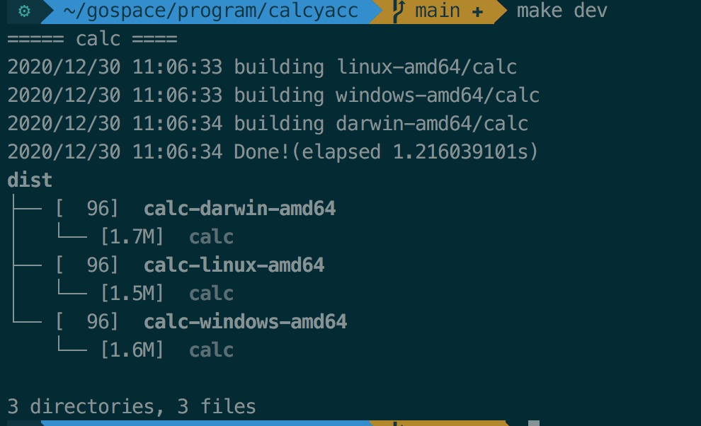

### Info

使用goyacc技术，实现一个简单的四则运算小程序

### usage
```
>1+2*4
9
>bye
exit status 1
```

### dev
Lex & Yacc 用来生成词法分析器和语法分析器的工具， yacc是比较古老的技术，go语言官方工具集中包含了goyacc

```
# 安装
go get -u golang.org/x/tools/goyacc
# 注意安装时，设置goproxy, 避免被墙，另外注意GO111MODULE是否开启
```

词法分析：
这里分词没有使用lex工具，直接代码扫描实现
词法分析主要就是做分词，如该程序中实现的计算器，每个字符就是一个token，分词比较简单，通过scan扫描文本, 区分出数值和符合

lex中需要实现两个接口
```
# 扫描的实现
func (l *lex) Lex(lval *yySymType) int {
}

# 错误处理
func (l *lex) Error(s string) {
}
```

语法分析：
定义.y文件
```
# 内嵌的程序代码
%{

%}

# 映射对应的变量
%union{
}

# 定义终结符
%token

# 定义非终结符
%type

# 起始位
%start main

# 定义语义
%%
expression : expression '+' term
                { $$ = $1 + $3 }
           | expression '-' term
                { $$ = $1 - $3 }
           | term
                { $$ = $1 }
term       : term '*' factor
                { $$ = $1 * $3 }
           | term '/' factor
                { $$ = $1 / $3 }
           | factor
                { $$ = $1 }
factor     : NUM
                { $$ = $1 }
           | '(' expression ')'
                { $$ = $2 }
%%
```

这里的语义声明算是一种声明式的编程，只需要关注结果是什么样，整个语义解析的过程是一个递归的

- $$ 表示:左边的
- $1 表示:右边第一项

定义好.y文件，通过goyacc工具生成语法解析代码
```
goyacc -l -o parse/calcyacc.go parse/calcyacc.y
```

### 编译构建
```
# 多版本交叉编译构建
make dev
```
